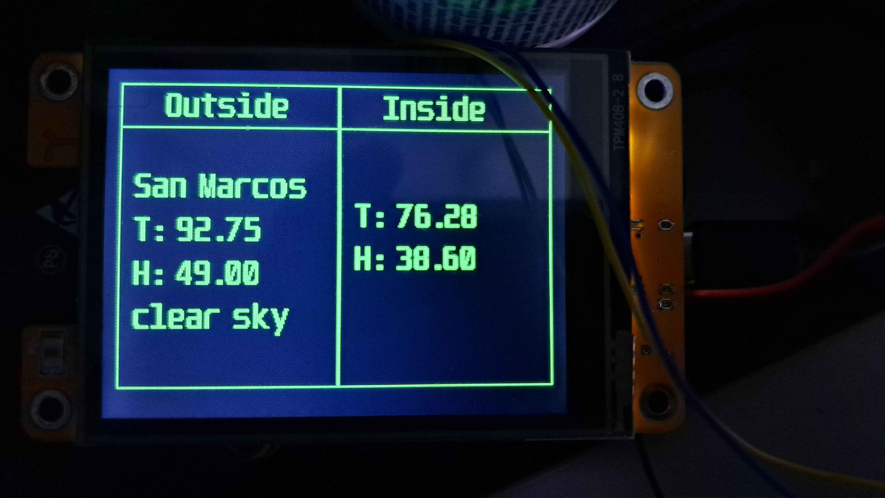

# MTMT-209

Repository for my MicroThisMicroThat article in FCM-209 (September 2024)

## CYD (Cheap Yellow Display) and Micropython

Welcome to this repository for my September 2024 MicroThisMicroThat article where I discuss rather deeply the Cheap Yellow Display (CYD) better known as the ESP32-2432s028r, an integrated ESP-32 and ili9341 touchscreen display.

I spend the majority of the article discussing the CYD in general along with a few lines about using the board under Micropython.

While I'm still uploading files to this repository, one of the things that you will find here will be my Greg's Weather App.  This uses WiFi connection to the OpenWeatherMap to obtain the current outside conditions for my or your (with a bit of a program change on your part) location as well as connection a DHT22 directly to the CYD.

All of the code for this project is included including the fonts folder and the lib folder.

In order for the program to run, you must

- Obtain an API key to OpenWeatherMaps.org

- Edit the secrets.py file to include the Wireless SSID name and password, the OpenWeatherMap key and the Latitude and Longitude for your location.

- Copy all the code from the distibrution folder to the CYD into the proper folders on the CYD.  Use something like RShell to speed the process.
  
  

I'll add more information here as I add other demos.
